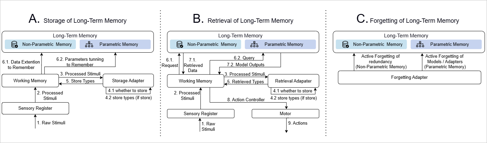

# SALM: Self-adaptive Long-term Memory

## 📖 Overview

This repository implements the **Self-Adaptive Long-term Memory (SALM)** framework as proposed in the paper *"Human-inspired Perspectives: A Survey on AI Long-term Memory"* ([arXiv:2411.00489](https://arxiv.org/pdf/2411.00489)). SALM is a cognitive architecture that enables AI systems to dynamically manage both parametric (LoRA adapters) and non-parametric (textual context) memory through adaptive storage, retrieval, and forgetting mechanisms.

## 🏗️ Architecture

The SALM framework consists of three core components working in parallel across multiple decision branches:



*Figure 1: SALM architecture with Storage, Retrieval, and Forgetting adaptors operating on parallel decision branches.*

- **Storage Adaptor**: Decides whether to store information in parametric (LoRA) or non-parametric memory
- **Retrieval Adaptor**: Determines which memory sources to query and how to combine them
- **Forgetting Adaptor**: Manages memory cleanup by removing outdated or low-quality entries

## 📁 Repository Structure

```
.
├── main.py                 # Main experiment orchestration
├── tree.py                 # Multi-branch decision tree structures
├── memory.py               # Parametric memory (LoRA) management
├── adaptors.py             # Storage, retrieval, forgetting networks
├── utils.py                # Utility functions and helper classes
├── requirements.txt        # Python dependencies
├── structure.png           # Architecture diagram
├── dataset/                # Place your dataset here
│   └── longmemeval_s_cleaned.json  # LongMemEval_S dataset (expected)
├── model/                  # Place the base model here
│   └── Meta-Llama-3-8B-Instruct/   # Expected model directory
└── results/                # Experiment outputs (created automatically)
```

## 🚀 Installation

### Prerequisites
- Python 3.8 or higher
- CUDA-compatible GPU (recommended for training)

### Setup
```bash
# Clone the repository
git clone <your-repo-url>
cd <repo-name>

# Install dependencies
pip install -r requirements.txt
```

## 📊 Dataset

This implementation is designed to work with the **LongMemEval_S** dataset from the [LongMemEval](https://github.com/xiaowu0162/LongMemEval) benchmark.

### Dataset Preparation
1. Download the `longmemeval_s_cleaned.json` file from the LongMemEval repository
2. Place it in the `dataset/` directory at the root of this project
3. Ensure the file structure looks like:
   ```
   dataset/
   └── longmemeval_s_cleaned.json
   ```

The dataset contains conversation sessions with questions, answers, and haystack (context) information used to evaluate long-term memory capabilities.

## 🤖 Base Model

The framework uses **Meta-Llama-3-8B-Instruct** as the underlying language model.

### Model Setup
1. Download the model from Hugging Face or your preferred source
2. Place it in the `model/` directory:
   ```
   model/
   └── Meta-Llama-3-8B-Instruct/
       ├── config.json
       ├── model-00001-of-0000X.safetensors
       └── ...
   ```
3. The code will automatically load from this path

## ⚙️ Configuration & Running

The framework supports extensive configuration through command-line arguments. Below are the available options and typical usage scenarios.

### Command-line Arguments

| Argument | Type | Default | Description |
|----------|------|---------|-------------|
| `--if_no_parametric` | bool | False | Disable parametric memory (LoRA adapters) |
| `--if_no_non_parametric` | bool | False | Disable non-parametric memory (textual context) |
| `--num_repeat` | int | 1 | Number of experiment repetitions |
| `--max_branches` | int | 20 | Maximum number of parallel decision branches |
| `--merge_similarity_threshold` | float | 0.9 | Threshold for merging similar branches (0-1) |
| `--num_samples` | int | 128 | Number of samples to process from dataset |

### Usage Examples

#### 1. **Full SALM Configuration** (both memory types enabled)
```bash
python main.py --num_repeat 3 --max_branches 32 --num_samples 256
```
*Runs 3 repetitions with 32 parallel branches on 256 samples using both memory systems.*

#### 2. **Parametric Memory Only**
```bash
python main.py --if_no_non_parametric True --max_branches 20 --num_samples 128
```
*Disables non-parametric memory to isolate parametric memory performance.*

#### 3. **Non-parametric Memory Only**
```bash
python main.py --if_no_parametric True --max_branches 16 --num_samples 100
```
*Disables parametric memory to evaluate non-parametric memory effectiveness.*

#### 4. **High Branch Exploration**
```bash
python main.py --max_branches 64 --merge_similarity_threshold 0.8 --num_repeat 2
```
*Explores more branches (64) with lower merge threshold (0.8) for broader decision space.*

#### 5. **Fast Testing**
```bash
python main.py --num_samples 10 --max_branches 8 --num_repeat 1
```
*Quick test run with minimal samples and branches.*

## 📊 Output Structure

Results are saved in timestamped directories under `results/`:
```
results/multi_session_multi_branch_with_forgetting_YYYYMMDD_HHMMSS_repeatN_all_branches_maxX_mergeY_config/
├── repeat_stats/              # Per-repeat statistics
│   ├── repeat_0_raw.json      # Raw data for repeat 0
│   ├── repeat_0_stats.json    # Aggregated stats for repeat 0
│   └── ...
├── experiment_stats.json      # Cross-repeat aggregated results
└── console_output.log         # Complete execution log
```

## 📚 Citation

If you use this code or the SALM framework in your research, please cite the original paper:

```bibtex
@article{he2024human,
  title={Human-inspired Perspectives: A Survey on AI Long-term Memory},
  author={He, Zihong and Lin, Weizhe and Zheng, Hao and Zhang, Fan and Jones, Matt W and Aitchison, Laurence and Xu, Xuhai and Liu, Miao and Kristensson, Per Ola and Shen, Junxiao},
  journal={arXiv preprint arXiv:2411.00489},
  year={2024}
}
```

## 📝 License

This project is licensed under the MIT License - see the LICENSE file for details.

## 🙏 Acknowledgments

- The **SALM** framework is based on theoretical work from [arXiv:2411.00489](https://arxiv.org/pdf/2411.00489)
- Evaluation uses the **LongMemEval** benchmark ([GitHub](https://github.com/xiaowu0162/LongMemEval))
- Base model: **Meta-Llama-3-8B-Instruct** by Meta

> **Note**: Please ensure you have the appropriate permissions and comply with the license terms for the LongMemEval dataset and Meta-Llama-3-8B-Instruct model before use.